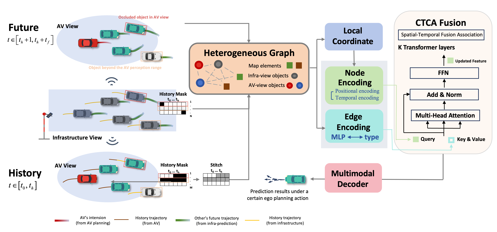

# Co-MTP: A Cooperative Trajectory Prediction Framework with Multi-Temporal Fusion for Autonomous Driving

[](https://xiaomiaozhang.github.io/Co-MTP/)
[](https://arxiv.org/abs/2502.16589)

This is the official implementation of ICRA 2025 paper: "Co-MTP: A Cooperative Trajectory Prediction Framework with Multi-Temporal Fusion for Autonomous Driving", [Xinyu Zhang*](), [Zewei Zhou*](https://zewei-zhou.github.io/), [Zhaoyi Wang](https://wi11ione.github.io/), [Yangjie Ji](), [Yanjun Huang](https://www.linkedin.com/in/yanjun-huang-46099b82/), [Hong Chen](https://scholar.google.com/citations?hl=zh-CN&user=n_eA148AAAAJ). (*Indicates Equal Contribution)



## Introduction
Co-MTP is a general cooperative trajectory prediction framework with multi-temporal fusion for autonomous driving, which leverages the V2X system to fully capture the interaction among agents in both history and future domains to benefit the planning.

We evaluate the Co-MTP framework on the real-world dataset [V2X-Seq](https://github.com/AIR-THU/DAIR-V2X-Seq), and the results show that Co-MTP achieves **SOTA** performance and that both history and future fusion can greatly benefit prediction.

## Installation
We suggest using exactly the same environment as provided to avoid any issues:

```bash
conda create -n co-mtp python=3.8
conda activate co-mtp

pip install torch==1.10.1+cu113 torchvision==0.11.2+cu113 torchaudio==0.10.1 -f https://download.pytorch.org/whl/cu113/torch_stable.html
pip install tensorflow tensorboard

wget https://anaconda.org/dglteam/dgl-cuda11.3/0.7.2/download/linux-64/dgl-cuda11.3-0.7.2-py38_0.tar.bz2
conda install --use-local dgl-cuda11.3-0.7.2-py38_0.tar.bz2 -y
conda install protobuf=3.20 -y

pip install -r requirements.txt
```

## Dataset Preparation
1. Download the dataset V2X-Seq-TFD through the dataset link provided above and save the data into the {DATA_ROOT} directory './dataset/V2X-Seq-TFD'
```bash
export DATA_ROOT=${PWD}'/dataset/V2X-Seq-TFD'
```

2. Merge multiple maps into one map
```bash
python preprocess/maps_merge.py --data_root ${DATA_ROOT}
```

3. Preprocess cooperative-view trajectories
```bash
python preprocess/fusion_for_prediction.py --data_root ${DATA_ROOT} --split train
python preprocess/preprocess_v2x.py --data_root ${DATA_ROOT} --split train
python preprocess/fusion_for_prediction.py --data_root ${DATA_ROOT} --split val
python preprocess/preprocess_v2x.py --data_root ${DATA_ROOT} --split val
```
4. Preprocess infrastructure-view raw trajectories
```bash
python preprocess/fusion_for_prediction.py --data_root ${DATA_ROOT} --split train
python preprocess/preprocess_road.py --data_root ${DATA_ROOT} --split train
python preprocess/fusion_for_prediction.py --data_root ${DATA_ROOT} --split val
python preprocess/preprocess_road.py --data_root ${DATA_ROOT} --split val
```

## Training & Evaluation
We trained our model with 4 NVDIA 4090s in 5-6 days with the following command line:
```bash
python train.py --n_epoch 45 --batch_size 24 --val_batch_size 48 --port 49196 --gpu_number 4 --gpu 0,1,2,3 --use_planning True --v2x_prediction True --use_road_obs True --use_other_fut True --road_prediction False --name co-mtp 
```

## Citation
If you find this repository useful for your research, please consider giving us a star 🌟 and citing our paper.
 ```bibtex
@article{zhou2024v2xpnp,
  title={Co-MTP: A Cooperative Trajectory Prediction Framework with Multi-Temporal Fusion for Autonomous Driving},
  author={Zhang, Xinyu and Zhou, Zewei and Wang, Zhaoyi and Ji, Yangjie and Huang, Yanjun and Chen, Hong},
  journal={arXiv preprint arXiv:2502.16589},
  year={2025}
}
```

## Contact
If you have any questions or suggestions, please feel free to open an issue or contact us (*2332922@tongji.edu.cn* or *zeweizhou@ucla.edu*).


